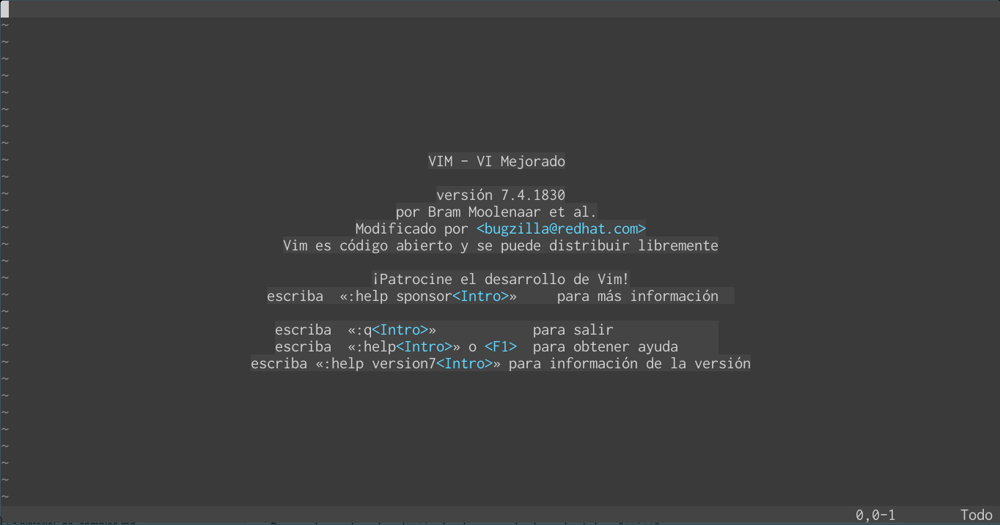

# Introduccion.

La finalida del proyecto es simular un entorno de desarrollo integrado, le dare especial soporte al resaltado de syntaxis y otras extensiones para mejorar la experiencia del programador usando vim.

Hasta el momento las mejoras se encuentran realizadas para los siguientes lenguajes:

- **Lenguaje C**
- **Lenguaje Python**
- **WEB**
- **Librerias de desarrollo de Gnome**
- **Libreria OpenGL**
- **Libreria MPI**
- **Librerias ANSI C**
- **Proximamente ncurses**
- **Proximamente glibc**
- **Proximamente QT**
- **En progreso Linux kernel API**

Se encuentra integrados algunos plugins entre ellos estan:
- **ConqueGDB**
- **CloseTag**
- **Autopairs**
- **Neocomplete**
- **Ninja**
- **Syntastic**
- **SingleCompile**

De momento me encuentro integrando mejoras en:
- **Php Omnicompletion**
- **Java Omnicompletion**

Tambien se encuentras los snippets creados por la comunidad Aztli agregando varios mas para el lenguaje C y WEB.

Algunos snippets han sido creados por nuestra cuenta:
- **html5** -> Tambien editados.
- **css3**
- **javascript**
- **python** --> Tambien editados.
- **C** --> Solo los snippets de Ansi C.
- **C++** -> En construcción..
- **markdown** --> Por ser implementados. 

# Instalacion y configuracion.
Para probarlo deberas hacer lo siguiente:
En el home de tu usuario clona el repositorio de la siguente manera:

`git clone https://github.com/wozgeass/Vim-IDE.git .vim`

Listo ahora ya podras tener las opciones del Vim-IDE habilitadas.

> **Nota:** Es importante que si usas una distribucion como ubuntu instales vim-nox para que funcionen algunos plugins ya que en mucho casos necesita soportes extras que el editor vim por defecto no tiene.

Lo que deberas ahora sera elegir un tema de color, hasta el momento tengo los siguientes:
- **coots-beauty-256**
- **grimmjow**
- **jellybeans** *(Con modificaciones propias)*
- **PaperColor**

Solo agrega la opcion que quieras para tema de color en el vimrc local dentro de la carpeta que clonaste.
El tema de color por defecto es el siguiente:

Ademas se encuentra habilitado el omnicomplete para los siguientes lenguajes:
- **Python**
- **Javascript**
- **html5**
- **css3**
- **xml**
- **php5**
- **C**
- **C++**
- **Java**

> *Nota:* Para que funcione mejor python-ninja es necesario instalarlo desde los paquetes del sistema:

Para ubuntu y Debian:
> **apt install vim-jedi** 

Para Fedora, CentOS y derivados:
> **dnf install vim-jedi**

Y para que funcione el syntastic para bash es necesario el siguiente paqute:
Para Ubuntu y Debian:
> **apt install shellcheck**

Para Fedora, CentOS y derivados:
> **dnf install ShellCheck**
